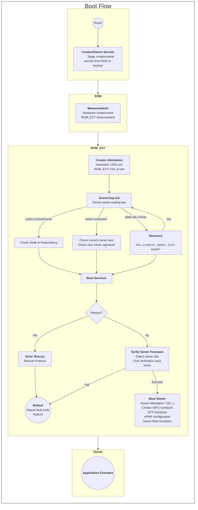
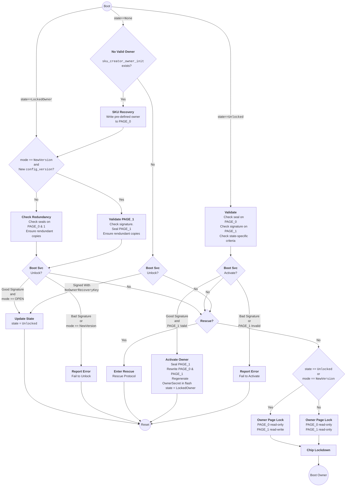

# Boot Flows

## ROM_EXT Boot to Owner Firmware

The following diagram focuses on the ROM_EXT boot stage.

Notes:
- The owner sealing key is derived at the CDI_0 stage.
- If `sku_creator_owner_init` exists and is called, the ownership state is re-evaluated aftewards.
- The CDI_1 state of `keymgr` is initialized with owner measurements.
  - When the chip is in the `LockedOwner` state, the CDI_1 sealing diversification constants are chosen based on the application key used to validate the owner firmware.
  - When the chip is in an `Unlocked` state, the CDI_1 sealing diversification constant is set to `[0x55555555; 8]`.
- The OwnerSecret flash page is re-written upon successful activation of a new owner.
  - When the chip is in an `Unlocked` state, the CDI_1 attestation is derived from the current owner's key-ladder.
  - Upon tranistion from `Unlocked` to `LockedOwner`, the new OwnerSecret seed will cause the keymgr to derive different secrets.
    While the attestation in the `Unlocked` state may be trusted, that attestation is current owner's attestation.
    The attestation will become new owner's attestation after successful activation.

## Ownership State Transitions

The following diagram focuses on how ownership transfer manages ownership state transitions.
In the diagram:
- `state` refers to `ownership_state` in `boot_data`.
- `mode` refers to `update_mode` in the owner configuration.

